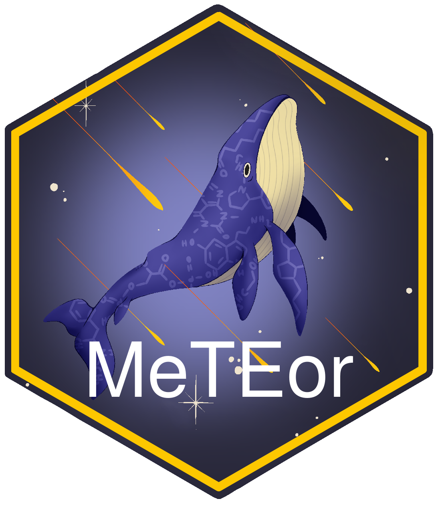

# MeTEor - MEtabolite Trajectory ExplORer 

# Overview

\`MeTEor\` is an R Shiny application that offers the possibility to explore longitudinal metabolomics data. For this purpose, a variety of statistical analysis and visualization methods are implemented in MeTEor to help the user to get a quick overview of the data.

Currently implemented features include:

-   **Dimensionality Reduction:** PCA, Modern Tensor Factorization (TCAM)
-   **Statistical models:** Linear Mixed Models, Mixed ANOVA, Friedman test
-   **Prediction models:** Logistic regression, Random Forest, XGBoost
-   **Network plots:** Pearson correlation network, Gaussian graphical model
-   **Ridge plots**
-   **Line plots**
-   **Cluster heatmaps**
-   **Volcano plots**
-   **Enrichment:** Map compounds (MetaboAnalyst API), Relational Database of Metabolomics Pathways (RaMP)

# Running MeTEor:

## Option 1: Docker

The recommended option for using MeTEor is the MeTEor Docker container, which is available on Docker Hub. To use it, make sure that Docker is installed.

For Docker installation please check: <https://docs.docker.com/engine/install/>

### Pull the Docker image:

``` bash
docker pull gordomics/meteor
```

### Run the Docker container:

#### Windows/Linux:

``` bash
docker run -d —rm -p 3838:3838 gordomics/meteor
```

#### MacOS:

``` bash
docker run --platform linux/amd64 -d --rm -p 3838:3838 gordomics/meteor
```

### Access the app:

To access the app paste this url into your browser: <http://localhost:3838/>

## **Option 2: Installation in R:**

MeTEor is also available as an R package. For the correct installation the setup of a Miniconda environment is necessary. The installation with the \`rminiconda\` package is described below for MacOS, Linux and Windows.

### Install rminiconda MacOS/Linux

```r
if (!requireNamespace("remotes", quietly = TRUE)) {
  install.packages("remotes")
}

remotes::install_github("hafen/rminiconda") 
rminiconda::install_miniconda(name='miniconda_for_meteor')
```

### Install rminiconda Windows

Please create an empty folder 'miniconda_py_r' on drive C./ . The reason is that for MeTEor an installation of Python is necessary. To make sure that everything can be installed correctly a Miniconda environment is created. A problem can arise if the directory in which Miniconda is installed contains spaces. A workaround is the installation on drive C./.

```r
if (!requireNamespace("remotes", quietly = TRUE)) {
  install.packages("remotes")
}

remotes::install_github("hafen/rminiconda") 
rminiconda::install_miniconda(path = "C:\\miniconda_py_r", name='miniconda_for_meteor')
```

### Install MeTEor

```r
remotes::install_git("https://git.rz.tu-bs.de/gordon.grabert/meteor")

library(MeTEor)

meteor()
```
