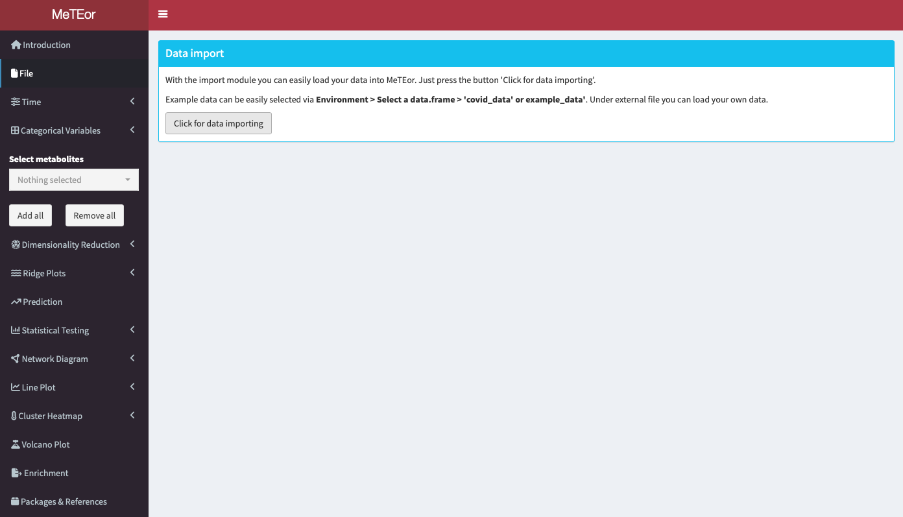
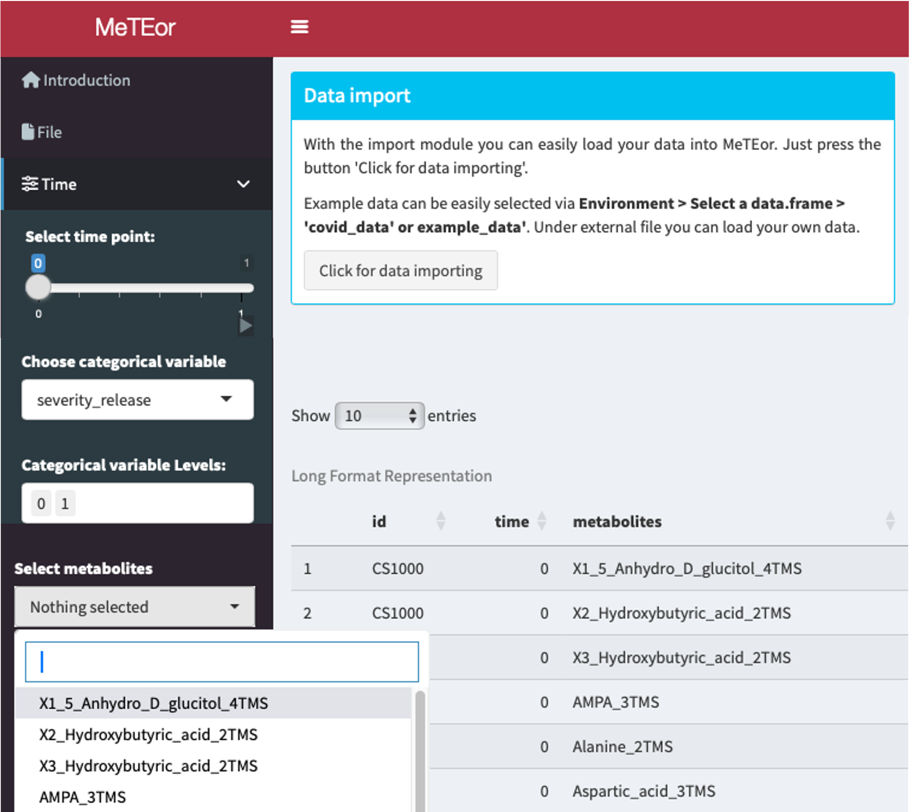
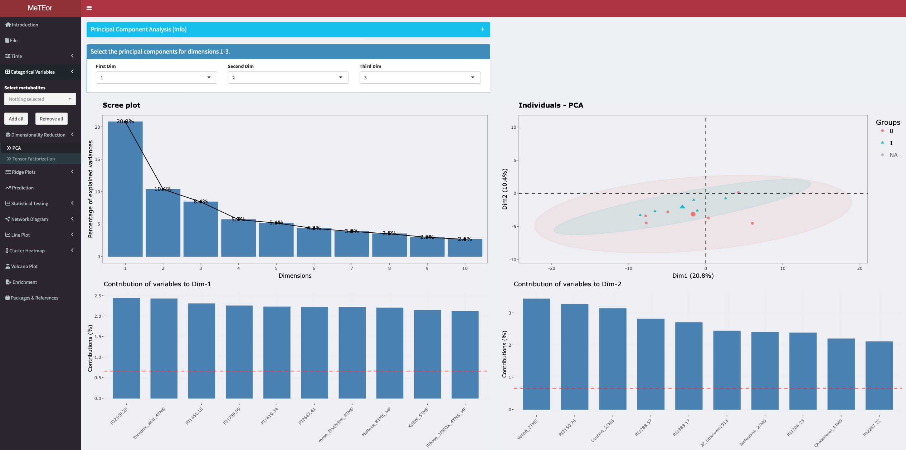
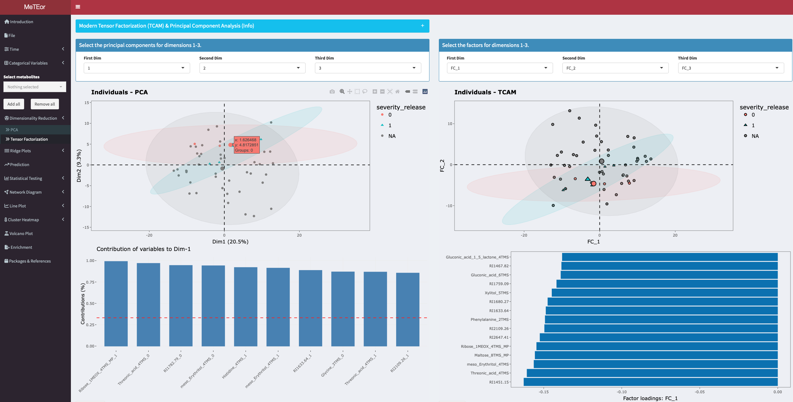
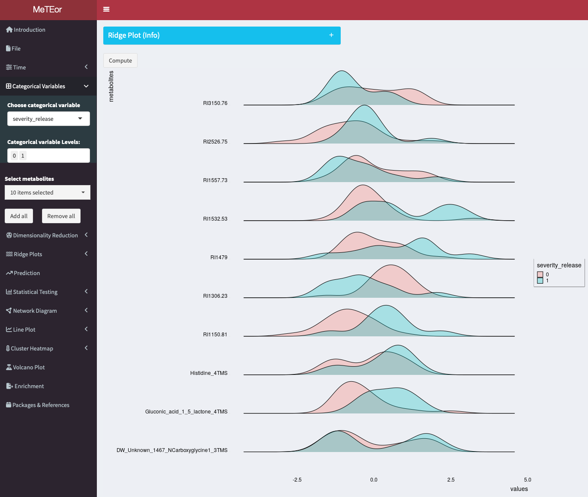
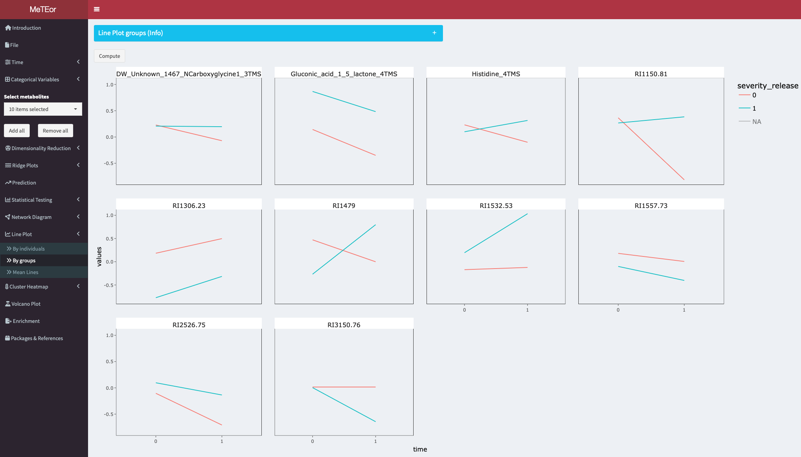
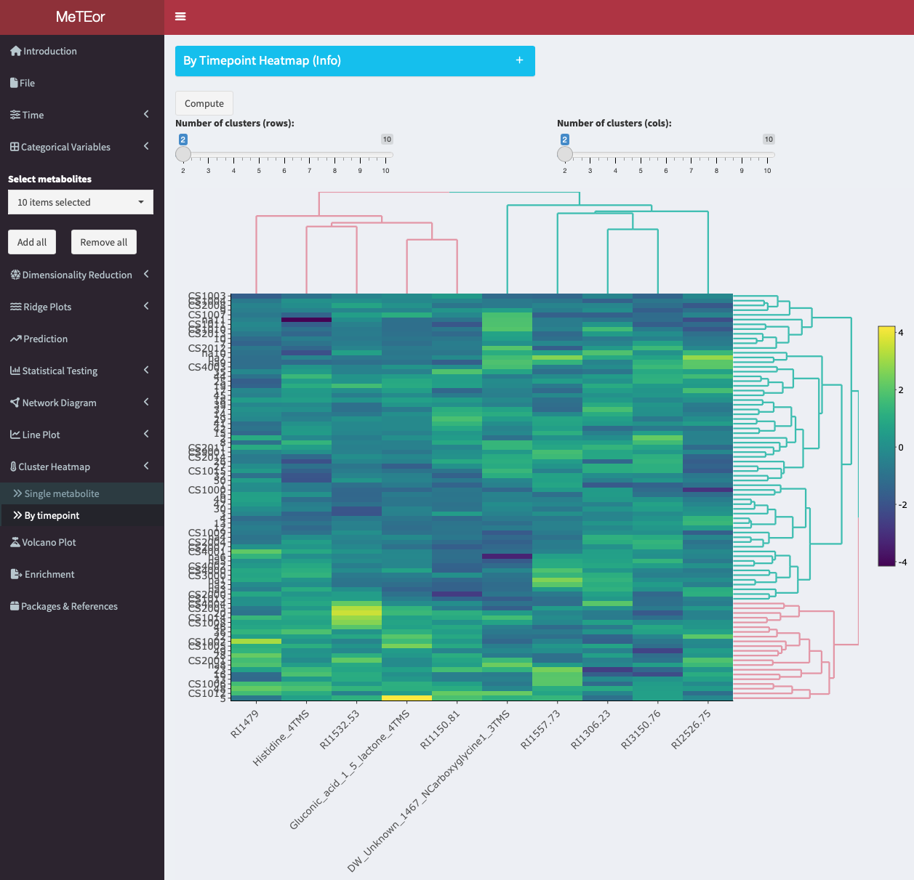

# MeTEor Tutorial

## Load Data

With the import module you can easily load your data into MeTEor. Just press the button 'Click for data importing'.

Example data can be easily selected via Environment \> Select a data.frame \> "covid_data" or "example_data". Under external file you can load your own data.

### Configurator

{width="500px"}

The covid_data is loaded in MeTEor. In the Configurator you can select a subset of the data for further analysis.

You can select the 

* timepoint 
* categorical variable
  + categorical variable levels
* metabolites

## Statistical Analysis

### PCA

A principal component analysis is performed for the selected time point. The eigenvalues of the principal components are shown in the diagram in the upper left corner. A scatter plot with the observations colored by the selected grouping variable is displayed in the upper right corner. The contributions of the variables to the principal components and a biplot are displayed at the bottom. A 3D scatterplot can also be created in the bottom panel. The principal components can be selected by dropdown menu for the different dimensions.

### TCAM

TCAM is an unsupervised tensor factorization method for the analysis of multiway data such as longitudinal omics data.

### Prediction

You can perform binary classification using three different algorithms: logistic regression (LR), random forest (RF), and XGBoost (XGB). Multiple sizes of the test set and the type of cross-validation to be used, either stratified 5-fold cross-validation or leave-one-out cross-validation (LOOCV). In instances where the test set size is set to 0%, the application will not compute an ROC curve. This section further provides a metabolite selection feature that allows you to load the ten most important features. The number can be less if features are not used by the model.

### rANOVA

Repeated measures ANOVA can be used for feature selection by analyzing how different features impact the outcome variable across multiple measurements or conditions within the same subjects. It helps identify significant features while considering within-subject correlations or dependencies, aiding in the selection of relevant predictors for the outcome variable.

## Visualization

### Ridge Plots

This section presents ridge plots contrasting the distribution of selected metabolites (see: Select Metabolites:) at different measurement time points. The measurement times to be compared can be selected in the menu below this box.

### Line Plots

Line plots to visualize the mean metabolite course of a category group. On the x-axis are the time points, for each metabolite. The lines are colored by the selected category.

### Cluster Heatmap

The Cluster Heatmap tool allows to visualize and cluster metabolite data across different time points for multiple metabolites. The tool generates a heatmap plot where each row represents a single observation, and each column represents the metabolites at the selected timepoint. The plot can be customized by changing the number of clusters for both rows and columns and be downloaded as a PNG image by right-clicking on it.

## Functional Analysis

### Pathway Enrichment

The enrichment analysis allows users to perform database queries for the selected metabolites. The top table displays the names of the chosen metabolites, which can be edited directly within the table. To initiate the analysis, users can send a query to the MetaboAnalyst API, which will generate a list of different identifiers for each metabolite, including HMDB, PubChem, ChEBI, KEGG, METLIN, and SMILES. Next, users can leverage the HMDB identifier to perform pathway enrichment analysis using the Relational Database of Metabolomics Pathways (RaMP). This analysis will return information about the pathways that involve the selected metabolites.
